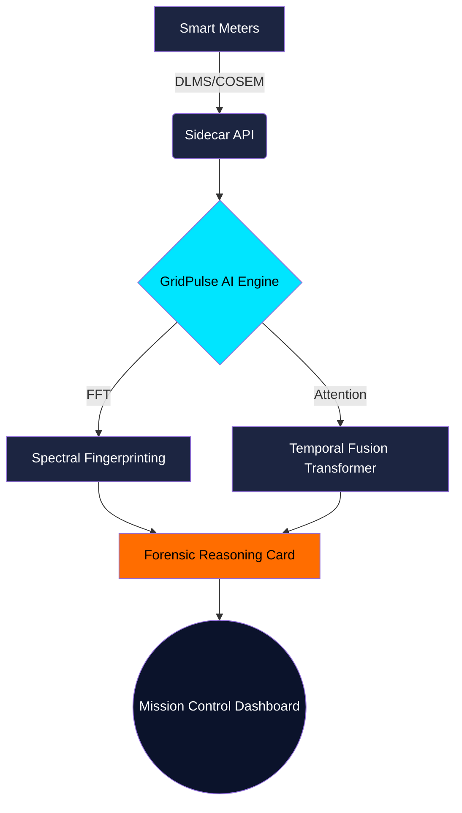

# GridPulse AI: Sovereign Grid Intelligence Platform

GridPulse AI is a national infrastructure solution designed to combat AT&C (Aggregate Technical & Commercial) losses through Physics-Informed Spectral Fingerprinting and Temporal Fusion Transformers.

## The Problem: "Invisible Bypass"
In standard distribution grids, illegal bypassing of meters creates massive AT&C losses. Traditional statistical models fail to detect these because the overall feeder consumption appears normal or is obscured by line losses. GridPulse AI detects these "invisible" taps mathematically.

## 🛡️ Non-Negotiable Compliance (Zero-Hardware)
This solution adheres strictly to government deployment constraints:
- **Zero Hardware Modification**: The system requires no physical changes to existing meters or data concentrators.
- **Interoperability**: Data is ingested via a simulated Sidecar API compliant with the **DLMS/COSEM (IEC 62056)** standard.
- **Sovereign Security**: AES-256 encryption is implemented across the Virtual DLMS Port.

## 🧠 Core Innovation
GridPulse AI moves beyond "Statistical Guessing" to **Physics-Informed Spectral Fingerprinting**.
1. **Spectral Disaggregation Engine (`src/spectral`)**: Uses Fast Fourier Transforms (FFT) to isolate specific Harmonic Distortion signatures (e.g., 300Hz arcing/hooking noise) from the standard 50Hz grid load.
2. **Temporal Fusion Transformer (`src/models/tft`)**: Predicts multi-horizon load while providing exact "Attention Heads" (Interpretability) to prove *why* the AI flagged an anomaly.

## 🏢 Integration with K-商業 (K-Commerce) & SWS
GridPulse AI isn't just about detecting theft—it acts as a foundational data layer for the entire state's digital roadmap.
- **Unique Business Identifier (UBID)**: The system uses UBID as the primary join key, cross-referencing spectral load signatures directly against commercial entity registries.
- **Automated Lifecycle Categorization**: By analyzing specific consumption patterns, the AI automatically categorizes a business as **Active, Dormant, or Closed**. This bridges the gap between physical infrastructure (Energy) and digital governance (Theme 1 & Theme 2 of the Karnataka Commerce & Industry framework).

## System Architecture



## 🚀 One-Click Deployment

To run the "Unbeatable Prototype" Demo for the Jury:

```bash
# Make the setup script executable (Linux/Mac)
chmod +x setup.sh

# Run the script (It will install dependencies, generate sandbox data, and launch Streamlit)
./setup.sh
```

*(Note for Windows users: You can run the commands inside `setup.sh` manually or use WSL/Git Bash).*

## Demo Instructions (For the 5-Minute Walkthrough)
1. **Data Analyst View**: Show the TFT Multi-Horizon forecast and SHAP feature importance.
2. **Live Detection**: Click "Trigger Bypass Hooking Event" in the sidebar.
3. **Forensic Card**: Watch the Spectral Analytics Engine isolate the 300Hz spike, presenting the AEE Field Engineer with a 94% Confidence Verdict and a GPS coordinate to inspect the exact pole.
4. **Government ROI**: Conclude on the Revenue Recovery dashboard showing the projected Crores saved across the BESCOM/HESCOM cluster.
